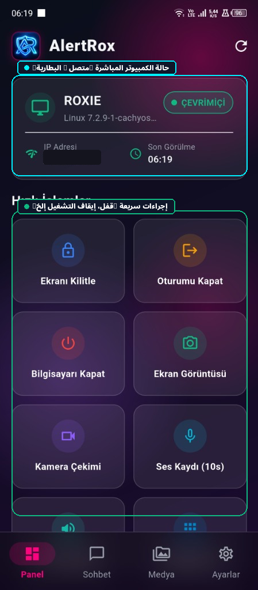
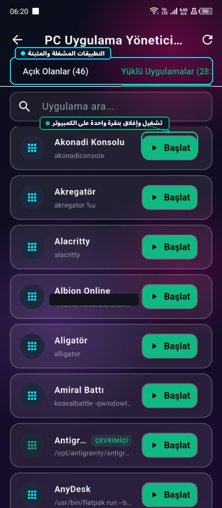
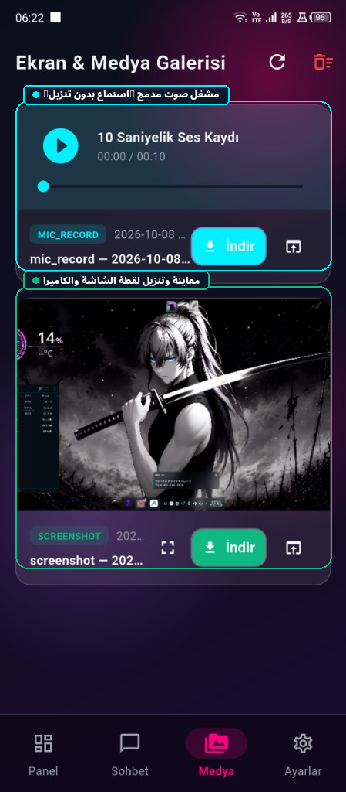
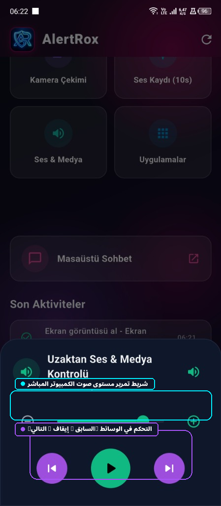
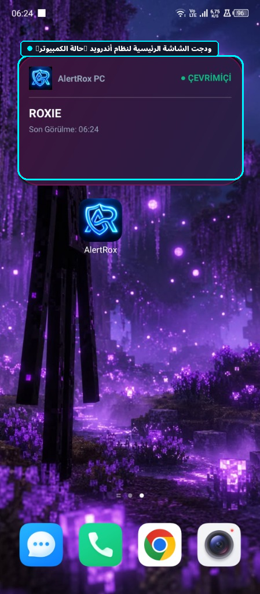
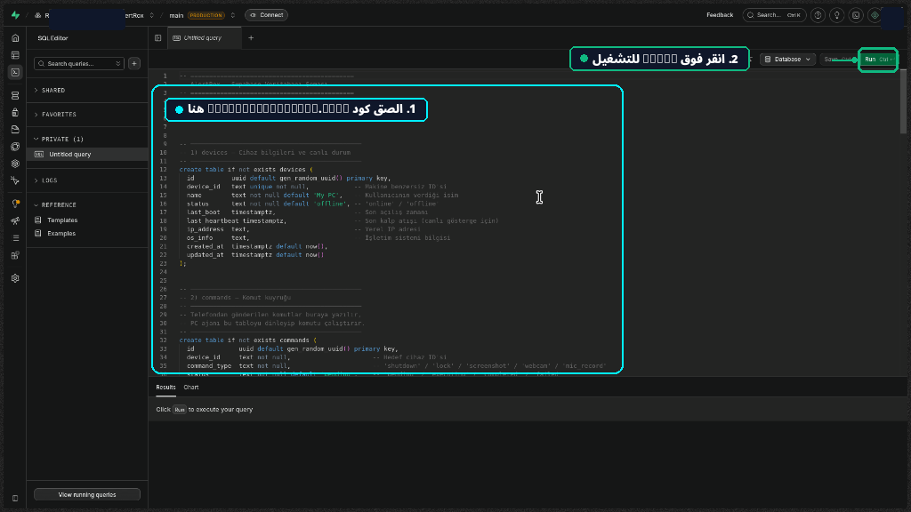

<div align="center">


# AlertRox — نظام مفتوح المصدر لأمان ومراقبة الكمبيوتر عن بُعد

نظام أمان متقدم يتيح لك التحكم الكامل ومراقبة جهاز الكمبيوتر الخاص بك عن بُعد من هاتفك الذكي.

[🇹🇷 Türkçe](README_TR.md) | [🇺🇸 English](README_EN.md) | [🇩🇪 Deutsch](README_DE.md) | [🇷🇺 Русский](README_RU.md) | [🇪🇸 Español](README_ES.md) | [🇸🇦 العربية](README_AR.md) | [🇫🇷 Français](README_FR.md) | [🇧🇷 Português](README_PT.md) | [🇨🇳 中文](README_ZH.md) | [🇯🇵 日本語](README_JA.md)

</div>

---

## 🌟 العربية

- 🛡️ **عميل خلفية الكمبيوتر:** يبدأ تلقائيًا مع تشغيل النظام ويرسل نبضات كل 10 ثوانٍ.
- 📱 **تطبيق Flutter:** تصميم عصري مع دعم كامل للوضع الداكن والفاتح والكتابة من اليمين لليسار (RTL).
- ⚡ **أداة الشاشة الرئيسية للأندرويد (Widget):** عرض حالة الكمبيوتر مباشرة على الشاشة الرئيسية.
- 🔒 **التحكم عن بُعد:** قفل الشاشة، تسجيل الخروج، إيقاف تشغيل الكمبيوتر.
- 📸 **المراقبة الفورية:** لقطات شاشة، صور الكاميرا، وتسجيل صوتي لمدة 10 ثوانٍ.
- 💬 **محادثة سطح المكتب:** شاشة دردشة فورية ثنائية الاتجاه بين الكمبيوتر والهاتف.
- 🖼️ **معرض الوسائط:** استعراض، تنزيل وحذف جميع الوسائط بنقرة واحدة.
- 🌐 **10 لغات:** العربية، التركية، الإنجليزية، الألمانية، الروسية، الإسبانية، الفرنسية، البرتغالية، الصينية، اليابانية.

---


---

## 📸 لقطات الشاشة والدليل المرئي

<div align="center">

| 🖥️ Dashboard | 📦 Apps | 🖼️ Media |
|:---:|:---:|:---:|
|  |  |  |

| 🔊 Volume | ⚡ Widget | 🛠️ Supabase SQL |
|:---:|:---:|:---:|
|  |  |  |

</div>

## 🛠️ دليل التثبيت

### 1. قاعدة بيانات Supabase
قم بتشغيل كود `supabase_schema.sql` داخل محرر SQL في Supabase.

<div align="center">
  
</div>

### 2. إعداد عميل الكمبيوتر (Linux)
```bash
cd AlertRox
bash scripts/install_autostart.sh
```

### 3. تطبيق الهاتف (Android)
قم بتنزيل ملف `AlertRox.apk` الجاهز من مخرجات GitHub Actions.

```bash
cd app
flutter run -d linux   # Desktop preview
flutter build apk      # Local Android build
```

---

<div align="center">
<sub>AlertRox • Open-Source Remote Security • RoxieG11</sub>
</div>
