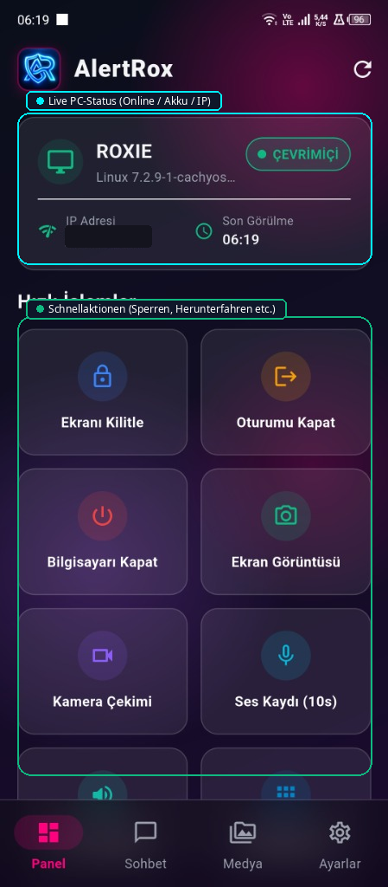
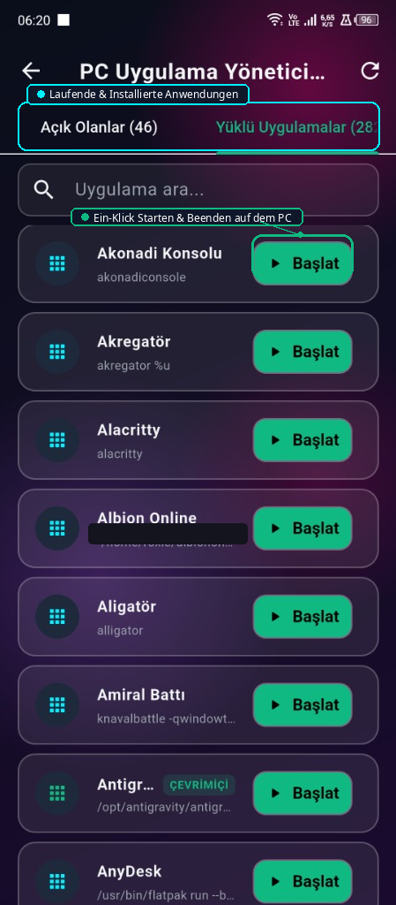
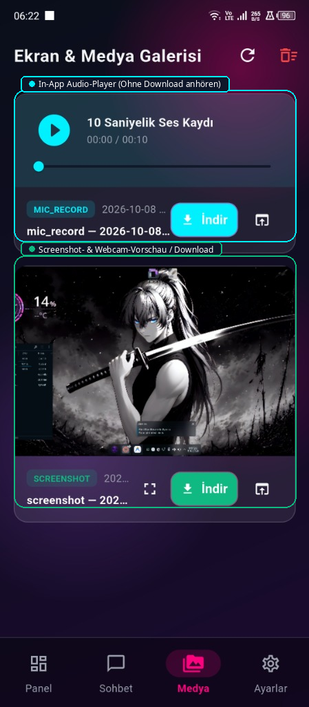
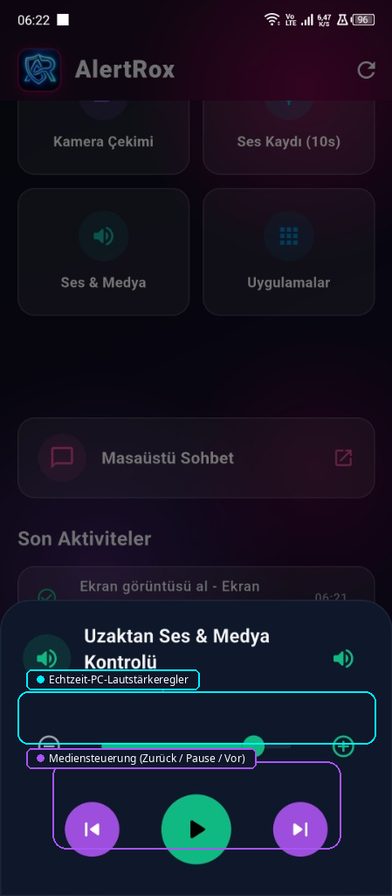
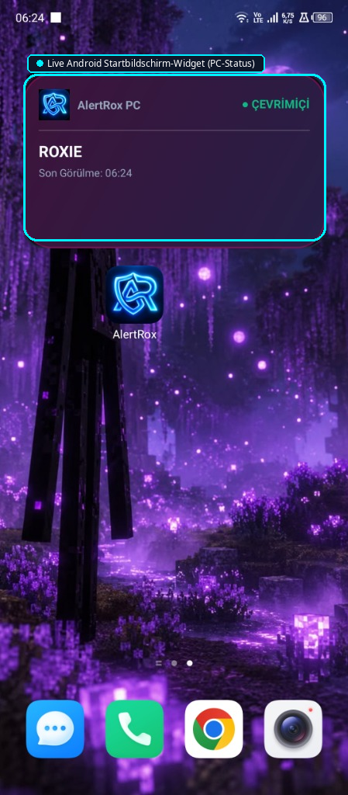
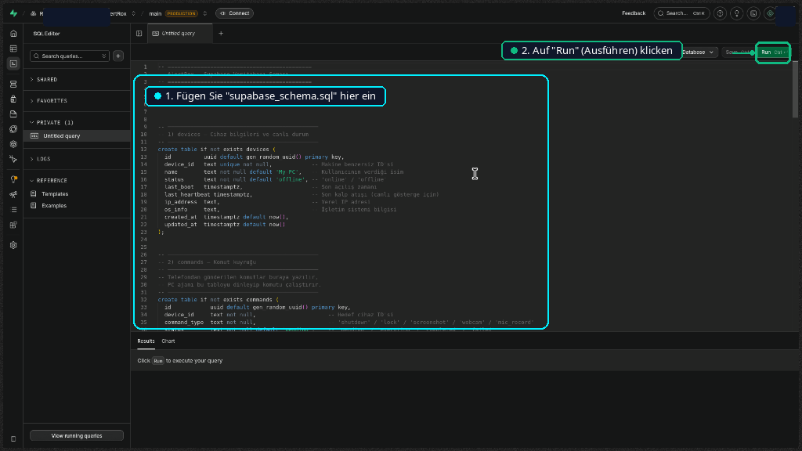

<div align="center">


# AlertRox — Open-Source-Fernüberwachung und PC-Sicherheit

AlertRox ist ein Open-Source-Sicherheitssystem zur vollständigen Fernsteuerung und Überwachung Ihres PCs per Smartphone.

[🇹🇷 Türkçe](README_TR.md) | [🇺🇸 English](README_EN.md) | [🇩🇪 Deutsch](README_DE.md) | [🇷🇺 Русский](README_RU.md) | [🇪🇸 Español](README_ES.md) | [🇸🇦 العربية](README_AR.md) | [🇫🇷 Français](README_FR.md) | [🇧🇷 Português](README_PT.md) | [🇨🇳 中文](README_ZH.md) | [🇯🇵 日本語](README_JA.md)

</div>

---

## 🌟 Deutsch

- 🛡️ **PC-Hintergrund-Agent:** Startet automatisch beim Hochfahren des Systems.
- 📱 **Flutter-App:** Modernes Material 3-Design mit Dunkel- und Hellmodus.
- ⚡ **Android Home-Widget:** Live-Online/Offline-Status auf dem Startbildschirm Ihres Smartphones.
- 🔒 **Fernsteuerungen:** Bildschirm sperren, Sitzung abmelden, PC herunterfahren.
- 📸 **Überwachung:** Live-Bildschirmfotos, Webcam-Aufnahmen, 10s Mikrofonaufnahme.
- 💬 **Desktop-Live-Chat:** Echtzeit-Nachrichten zwischen Mobilgerät und PC.
- 🖼️ **Medien-Galerie:** Dateien ansehen, herunterladen und mit einem Klick alle löschen.
- 🌐 **10 Sprachen:** Deutsch, Englisch, Türkisch, Russisch, Spanisch, Arabisch, Französisch, Portugiesisch, Chinesisch, Japanisch.

---


---

## 📸 Screenshots & Visuelle Anleitung

<div align="center">

| 🖥️ Dashboard | 📦 Apps | 🖼️ Media |
|:---:|:---:|:---:|
|  |  |  |

| 🔊 Volume | ⚡ Widget | 🛠️ Supabase SQL |
|:---:|:---:|:---:|
|  |  |  |

</div>

## 🛠️ Installationsanleitung

### 1. Supabase-Datenbank
Führen Sie `supabase_schema.sql` im Supabase SQL-Editor aus.

<div align="center">
  
</div>

### 2. PC-Agent einrichten (Linux)
```bash
cd AlertRox
bash scripts/install_autostart.sh
```

### 3. Mobile App (Android)
Laden Sie `AlertRox.apk` aus den GitHub-Releases herunter.

```bash
cd app
flutter run -d linux   # Desktop preview
flutter build apk      # Local Android build
```

---

<div align="center">
<sub>AlertRox • Open-Source Remote Security • RoxieG11</sub>
</div>
