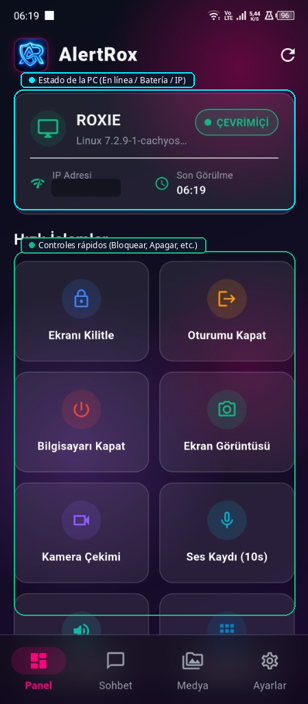
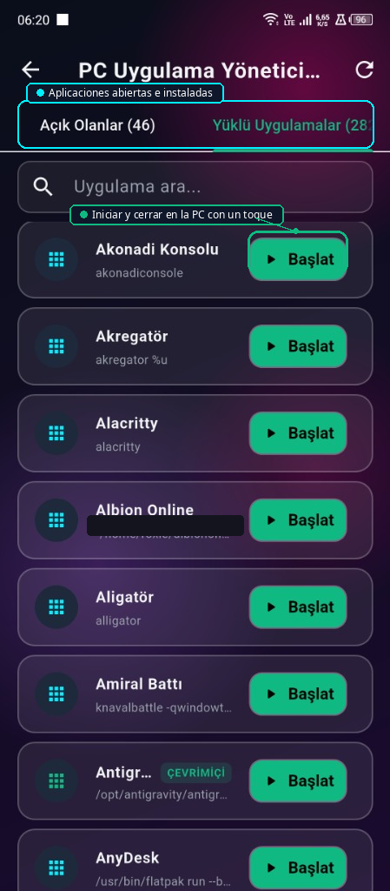
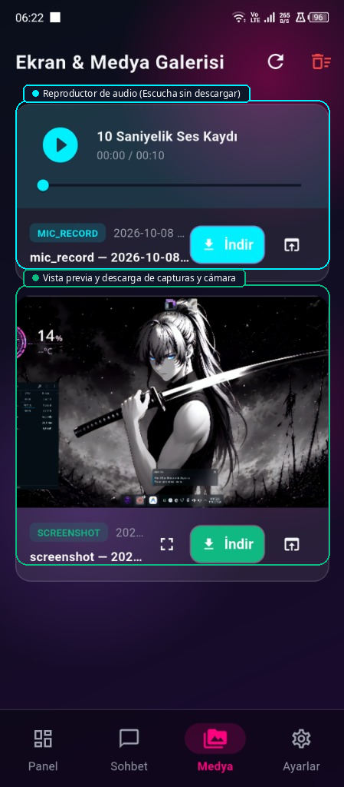
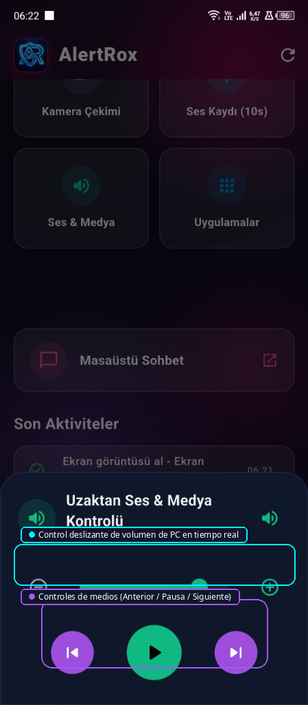
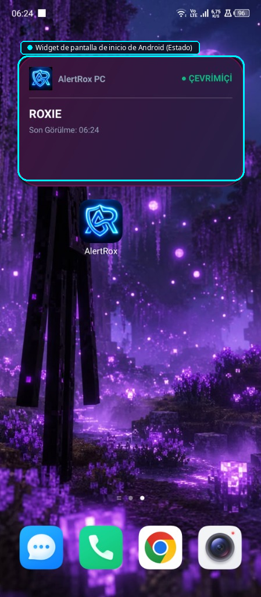
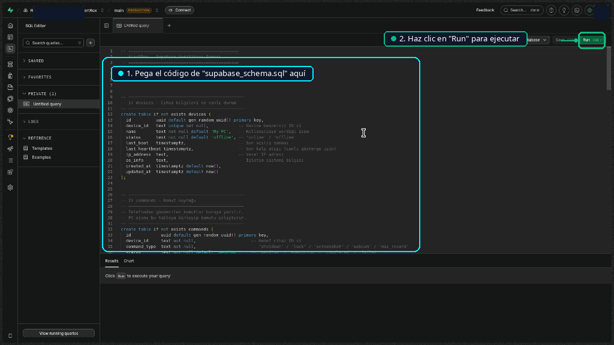

<div align="center">


# AlertRox — Sistema de Seguridad y Monitoreo Remoto de PC

AlertRox es un sistema de seguridad de código abierto que te permite monitorear y controlar tu PC de forma remota desde tu smartphone.

[🇹🇷 Türkçe](README_TR.md) | [🇺🇸 English](README_EN.md) | [🇩🇪 Deutsch](README_DE.md) | [🇷🇺 Русский](README_RU.md) | [🇪🇸 Español](README_ES.md) | [🇸🇦 العربية](README_AR.md) | [🇫🇷 Français](README_FR.md) | [🇧🇷 Português](README_PT.md) | [🇨🇳 中文](README_ZH.md) | [🇯🇵 日本語](README_JA.md)

</div>

---

## 🌟 Español

- 🛡️ **Agente en segundo plano:** Inicia automáticamente con el arranque del sistema.
- 📱 **App Flutter:** Material 3 con modo oscuro y claro de alto contraste.
- ⚡ **Widget Android:** Estado en línea/desconectado en la pantalla de inicio del teléfono.
- 🔒 **Controles Remotos:** Bloquear pantalla, cerrar sesión activa, apagar PC.
- 📸 **Vigilancia:** Capturas de pantalla, fotos de cámara, grabación de audio (10s).
- 💬 **Chat en Vivo:** Mensajería bidireccional instantánea entre el PC y el teléfono.
- 🖼️ **Galería Multimedia:** Ver, descargar y limpiar todo con un solo botón.
- 🌐 **10 Idiomas:** Español, Inglés, Turco, Alemán, Ruso, Árabe, Francés, Portugués, Chino, Japonés.

---


---

## 📸 Capturas de pantalla y guía visual

<div align="center">

| 🖥️ Dashboard | 📦 Apps | 🖼️ Media |
|:---:|:---:|:---:|
|  |  |  |

| 🔊 Volume | ⚡ Widget | 🛠️ Supabase SQL |
|:---:|:---:|:---:|
|  |  |  |

</div>

## 🛠️ Guía de Instalación

### 1. Base de datos Supabase
Ejecuta `supabase_schema.sql` en el Editor SQL de Supabase.

<div align="center">
  
</div>

### 2. Configuración del Agente PC (Linux)
```bash
cd AlertRox
bash scripts/install_autostart.sh
```

### 3. Aplicación Móvil (Android)
Descarga `AlertRox.apk` desde GitHub Actions o compílalo tú mismo.

```bash
cd app
flutter run -d linux   # Desktop preview
flutter build apk      # Local Android build
```

---

<div align="center">
<sub>AlertRox • Open-Source Remote Security • RoxieG11</sub>
</div>
