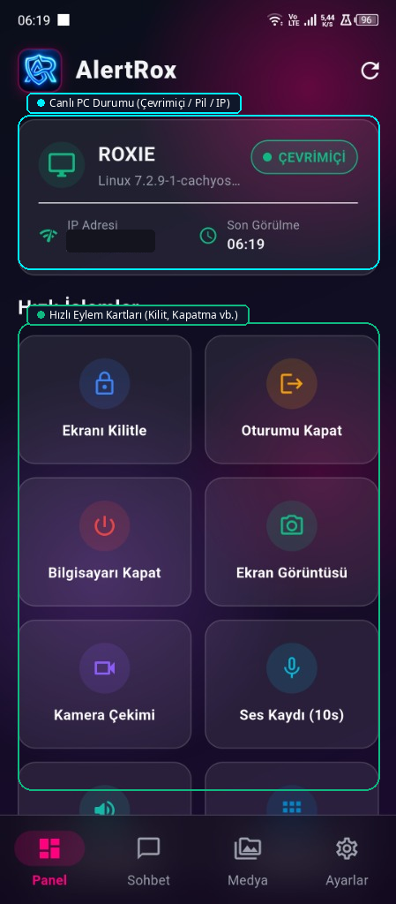
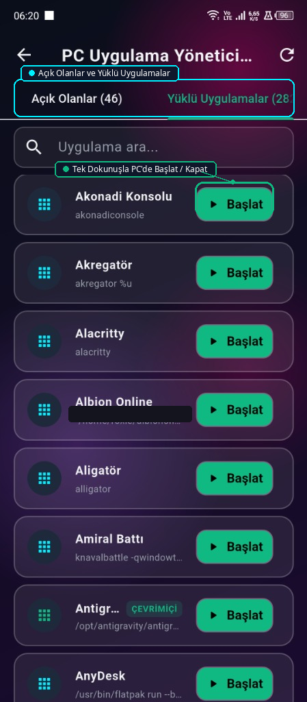
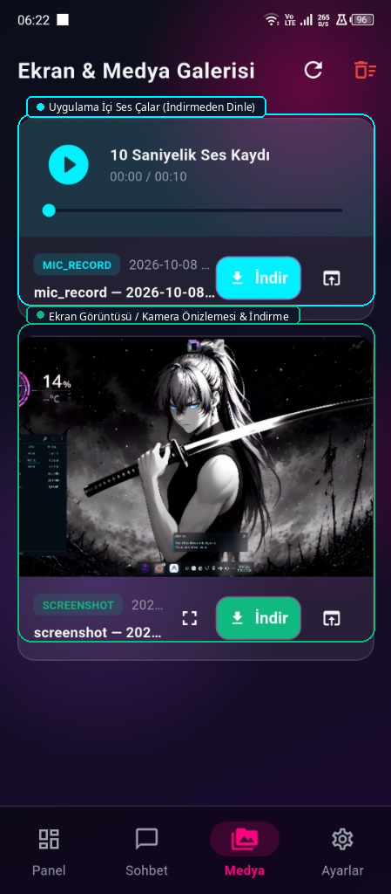
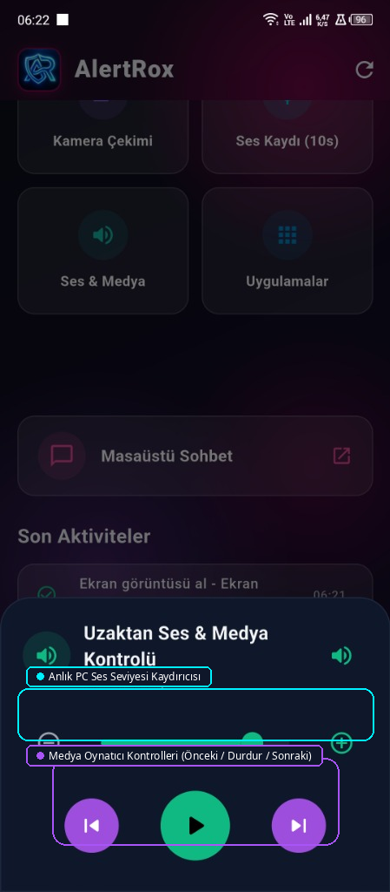
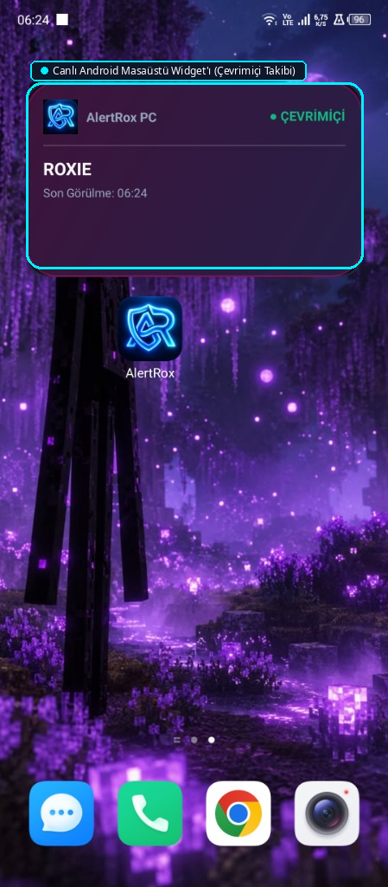
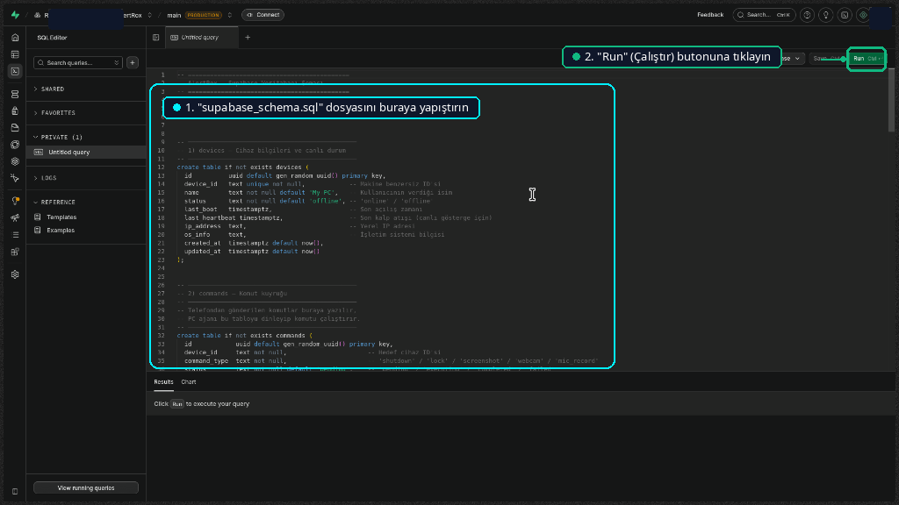

<div align="center">


# AlertRox — Açık Kaynaklı Uzaktan PC Güvenlik & İzleme Sistemi

AlertRox, evdeki veya ofisteki bilgisayarınızı cep telefonunuzdan tam kontrol altına almanızı sağlayan açık kaynaklı bir güvenlik sistemidir.

[🇹🇷 Türkçe](README_TR.md) | [🇺🇸 English](README_EN.md) | [🇩🇪 Deutsch](README_DE.md) | [🇷🇺 Русский](README_RU.md) | [🇪🇸 Español](README_ES.md) | [🇸🇦 العربية](README_AR.md) | [🇫🇷 Français](README_FR.md) | [🇧🇷 Português](README_PT.md) | [🇨🇳 中文](README_ZH.md) | [🇯🇵 日本語](README_JA.md)

</div>

---

> [!NOTE]
> 💡 **Açık Kaynak & Tamamen Ücretsiz**
> Bu uygulama açık kaynaklı ve tamamen ücretsiz şekilde geliştirilmiştir. Hiçbir abonelik, reklam veya ücretli özellik içermez.

## 🌟 Türkçe

- 🛡️ **PC Arka Plan Gözcüsü:** Bilgisayar açıldığı an (oturum açılmasa bile) arka planda otomatik başlar.
- 📱 **Flutter Mobil İstemcisi:** Modern Material 3 arayüz, yüksek kontrastlı Karanlık ve Aydınlık tema desteği.
- ⚡ **Android Canlı Masaüstü Widget'ı:** Telefonunuzun ana ekranında PC'nizin açık/kapalı durumunu anlık gösterir.
- 🔒 **Uzaktan Güvenlik Kontrolleri:** Ekran Kilitleme, Kullanıcı Oturumunu Kapatma, Bilgisayarı Kapatma.
- 📸 **Uzaktan Gözetim:** Canlı ekran görüntüsü alma, web kamerası fotoğrafı çekme, 10 saniye mikrofon ses kaydı.
- 💬 **Masaüstü Canlı Sohbet:** Mobil ile PC ekranı arasında anlık iki yönlü mesajlaşma penceresi.
- 🖼️ **Medya Galerisi:** Çekilen tüm görüntü ve sesleri inceleme, indirme ve tek tuşla tümünü temizleme.
- 🌐 **10 Dil Desteği:** Türkçe, English, Deutsch, Русский, Español, العربية (RTL), Français, Português, 中文, 日本語.

---


---

## 📸 Ekran Görüntüleri & Görsel Anlatım

<div align="center">

| 🖥️ Dashboard | 📦 Apps | 🖼️ Media |
|:---:|:---:|:---:|
|  |  |  |

| 🔊 Volume | ⚡ Widget | 🛠️ Supabase SQL |
|:---:|:---:|:---:|
|  |  |  |

</div>

## 🛠️ Kurulum ve Kullanım

### 1. Supabase Veritabanı
Supabase projenizin SQL Editor kısmına gidip `supabase_schema.sql` dosyasının içeriğini yapıştırın ve çalıştırın.

<div align="center">
  
</div>

### 2. PC Gözcü Servisinin Kurulumu (Linux)
```bash
cd AlertRox
bash scripts/install_autostart.sh
```

### 3. Mobil Uygulama (Android)
Telefonunuzdan doğrudan **[📲 AlertRox.apk İndir](https://github.com/RoxieG11/AlertRox/releases/latest/download/AlertRox.apk)** linkine dokunarak güncel sürümü kurun.

Kaynak koddan derlemek isterseniz:

```bash
cd app
flutter run -d linux   # Desktop preview
flutter build apk      # Local Android build
```

---

<div align="center">
<sub>AlertRox • Open-Source Remote Security • RoxieG11</sub>
</div>
